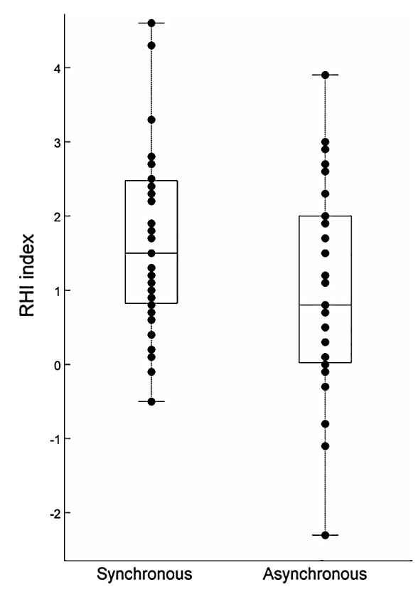

#### Article ID: bGRfF
#### Pilot: Catherine Thomas  
#### Co-pilot: Tom Hardwicke
#### Start date: 03/27/2017
#### End date: 03/28/2017

-------

#### Methods summary: 
Costantini et al. (2016) adds evidence on the link between multisensory integration and individual sensitivity to the rubber hand illusion (RHI), a method used to induce the feeling of body ownership of inanimate objects. They find that the greater an individual's temporal binding window, the greater temporal asynchrony an individual can tolerate in the rubber hand illusion. In this experiment, the authors attempted a new methodology for inducing the rubber hand illusion using a LED on the dorsal surface of the index finger of the rubber hand and a tactile stimulus attached to the dorsal surface of the index finger of the participant. 

In Experiment 1, the authors assessed whether the RHI method succcessfully induced an illusion of body ownership. The authors used a 9-item questionnaire which asked about the subjective perception of feeling that the rubber hand was like one's own hand. The 9 items were assessed on a 7-point Likert scale ranging from -3 to +3 where -3 is "fully disagree" and +3 is "fully agree." From these items, a RHI index was computed by subtracting the mean score of the six control items (4-9) from the three illusion items (1-3). The illusion is considered successful if the mean rating of this index is statistically different from the neutral mark on the scale ("neither agree/disagree" response, score of 0).  

------

#### Target outcomes: 
Using the Wilcoxon test, we assess whether the mean RHI index score in the synchronous condition is significantly greater than the central point, i.e. a score of 0, and whether the mean RHI index score is greater in the synchronous condition compared to the asynchronous condition. We aim to replicate the following results:

> Data violated the assumptions for normality (Shapiro-Wilks, p < 0.05). Wilcoxon rank tests are reported. As we implemented a new procedure to induce the RHI, using a LED on the rubber hand and a mechanical tapper on the participants’ hand, we firstly tested whether such induction procedure was effective in producing a reliable illusion. To this aim we tested whether mean rating to illusion statements were significantly different from the "neither agree/disagree" response (i.e. central point in the Likert scale). Illusion ratings after synchronous stimulation (Median(SD): 1.5(1.18)) was significantly higher than the central point (Wilcoxon test: p < 0.001). Hence, we can safely infer that we induced the RHI. Importantly, when comparing the synchronous and the asynchronous conditions (i.e. 25% rate of perceive synchrony) we found that participants experienced a significantly stronger RHI following the synchronous (median(SD) = 1.5(1.18)) compared to the asynchronous condition (median(SD) = 0.8(1.35); z(35) = 2.38; p = 0.017.

------

```{r global_options, include=FALSE}
knitr::opts_chunk$set(echo=TRUE, warning=FALSE, message=FALSE)
```

## Step 1: Load packages

```{r}
library(tidyverse) # for data munging
library(knitr) # for kable table formating
library(haven) # import and export 'SPSS', 'Stata' and 'SAS' Files
library(readxl) # import excel files
library(CODreports) # custom report functions
library(forcats) # handling factors
```

## Step 2: Load data

```{r}
d <- read_csv("data/data_manualClean.csv", col_names = TRUE, col_types = NULL, na = c("", "NA")) 
```

The data was manually edited in Excel such that the column titles reflected the measurement (e.g. RHI Index) and condition (Synchronous vs. Asynchronous).

## Step 3: Tidy data

```{r}
tidy.d <- d %>%
  select(Sync_RHI_Index, ASync_RHI_Index) %>%
  gather(Sync_RHI_Index, ASync_RHI_Index, key=Condition, value=RHI_index_score) %>%
  mutate(Condition = fct_recode(Condition, "Synchronous"="Sync_RHI_Index", "Asynchronous"="ASync_RHI_Index"))
```

## Step 4: Run analysis

### Descriptive statistics

We will first attempt to reproduce the descriptive statistics in the target outcomes: 

> Illusion ratings after synchronous stimulation (Median(SD): 1.5(1.18)) was significantly higher than the central point (Wilcoxon test: p < 0.001). Hence, we can safely infer that we induced the RHI. Importantly, when comparing the synchronous and the asynchronous conditions (i.e. 25% rate of perceive synchrony) we found that participants experienced a significantly stronger RHI following the synchronous (median(SD) = 1.5(1.18)) compared to the asynchronous condition (median(SD) = 0.8(1.35); z(35) = 2.38; p = 0.017.

```{r}
d_summary <- tidy.d %>%
  group_by(Condition) %>%
  summarise(Median = median(RHI_index_score), sd = sd(RHI_index_score))

synch <- d_summary %>% filter(Condition == "Synchronous")
asynch <- d_summary %>% filter(Condition == "Asynchronous")

# synchronous
compareValues(reportedValue = 1.5, obtainedValue = synch$Median)
compareValues(reportedValue = 1.18, obtainedValue = round(synch$sd, 2))

# asynchronous
compareValues(reportedValue = 0.8, obtainedValue = asynch$Median)
compareValues(reportedValue = 1.35, obtainedValue = round(asynch$sd, 2))
```

We'll now try to reproduce Figure 3 from the original article. Here's the original:


```{r graphs}
tidy.d %>% mutate(Condition = factor(Condition, levels = c("Synchronous", "Asynchronous"))) %>%
  ggplot(aes(x=Condition, y= RHI_index_score, ymin = -3, ymax = 3)) +
    geom_boxplot(alpha=.7) +
    geom_point() +
    ylab("RHI Index") +
    xlab("Condition") +
    ggtitle("Fig. 3: RHI Index Distribution by Condition") +
    theme_bw()
```

From eyeballing the graphs, they appear to match.

### Inferential statistics

Now we will attempt to reproduce the inferential statistics in the target outcomes: 

> Illusion ratings after synchronous stimulation (Median(SD): 1.5(1.18)) was significantly higher than the central point (Wilcoxon test: p < 0.001). Hence, we can safely infer that we induced the RHI. Importantly, when comparing the synchronous and the asynchronous conditions (i.e. 25% rate of perceive synchrony) we found that participants experienced a significantly stronger RHI following the synchronous (median(SD) = 1.5(1.18)) compared to the asynchronous condition (median(SD) = 0.8(1.35); z(35) = 2.38; p = 0.017.

```{r}
wilcox.test(d$Sync_RHI_Index, alternative = "greater", mu=0)$p.value 
```
The authors do not provide an exact p-value so we cannot directly compare. Nevertheless, the obtained p-value matches the description of p <.001.

```{r}
wilcox.out <- wilcox.test(d$ASync_RHI_Index, d$Sync_RHI_Index, paired = TRUE)
z <- abs(qnorm(wilcox.out$p.value/2)) # calculate z value
compareValues(reportedValue = .017, obtainedValue = round(wilcox.out$p.value,3), isP = T)
compareValues(reportedValue = 2.38, obtainedValue = round(z,2))
```

## Step 5: Conclusion

This reproducibility check was a success. All target outcomes were successfully reproduced.

```{r}
codReport(Report_Type = 'joint',
          Article_ID = 'bGRfF', 
          Insufficient_Information_Errors = 0,
          Decision_Errors = 0, 
          Major_Numerical_Errors = 0, 
          Minor_Numerical_Errors = 2)
```

```{r session_info, include=TRUE, echo=TRUE, results='markup'}
devtools::session_info()
```
